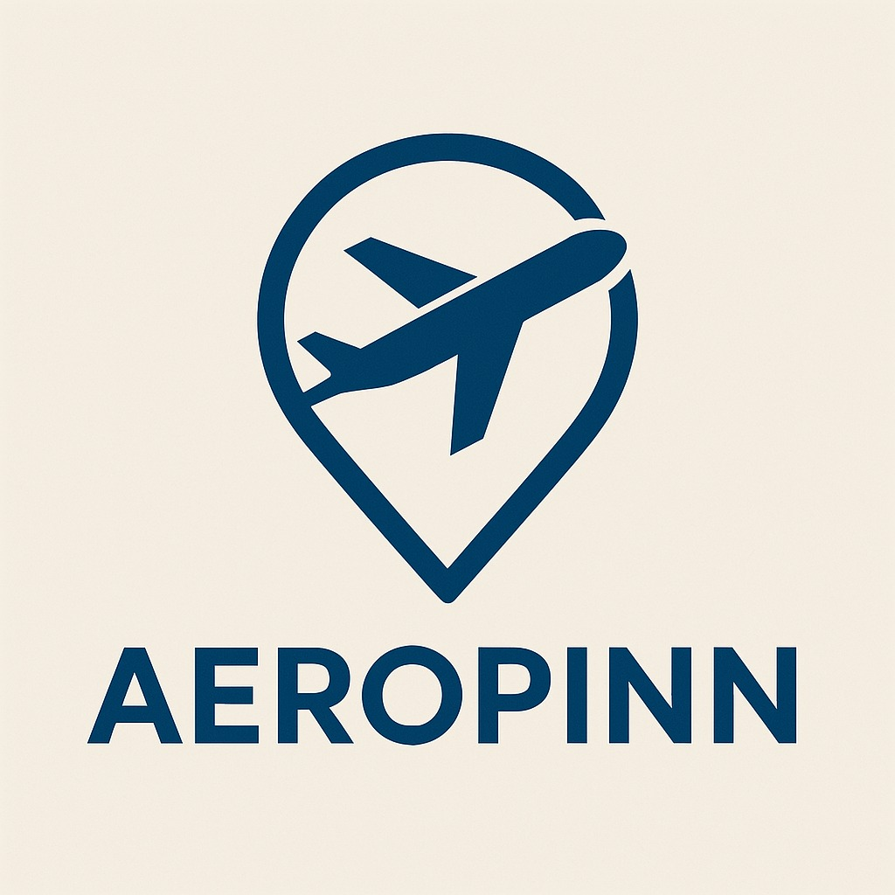
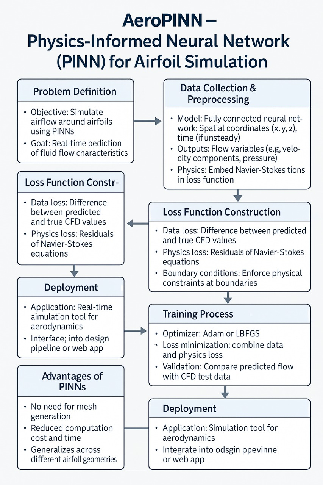

# AeroPINN
Leveraging Physics-Informed Neural Network(PINN) to simulate airflow patterns around arbitrary geometries(AirFoils) in real-time.
# AeroPINN

  
*Leveraging Physics-Informed Neural Networks (PINNs) to simulate airflow patterns around arbitrary airfoil geometries in real-time.*

---

[](https://www.python.org/)  
[](https://www.tensorflow.org/)  
[](LICENSE)  
[](https://github.com/CodeNinjaSarthak/AeroPINN/issues)  
[](https://github.com/CodeNinjaSarthak/AeroPINN/stargazers)

## Overview

AeroPINN is an innovative tool that combines **Physics-Informed Neural Networks (PINNs)** with computational fluid dynamics (CFD) to simulate airflow patterns around arbitrary airfoil geometries in real-time. By embedding the **Continuity Equation** and other physical constraints into the neural network's loss function, AeroPINN achieves fast, accurate predictions of velocity (\(u, v\)) and pressure (\(p\)) fields without the computational overhead of traditional CFD solvers.

### Key Features
- **Real-Time Simulation**: Predict airflow patterns in milliseconds.
- **Physics-Driven**: Enforces fluid dynamics principles (e.g., incompressibility).
- **Flexible Geometry**: Works with any 2D airfoil shape provided as spatial coordinates.
- **Lightweight**: Built with Python, TensorFlow, and NumPy for easy deployment.

---

## How It Works

AeroPINN uses a deep neural network trained on spatial coordinates (\(x, y\)) to predict airflow properties (\(u, v, p\)). The loss function integrates:
1. **Data Loss**: Matches predictions to known data points (if available).
2. **Physics Loss**: Enforces the Continuity Equation (\(\frac{\partial u}{\partial x} + \frac{\partial v}{\partial y} = 0\)) for incompressible flow.

The network leverages automatic differentiation to compute spatial derivatives, ensuring physical consistency.



---

## 🚀 Team

Meet the minds behind **AeroPINN**:  

- [Sarthak Chauhan](https://github.com/CodeNinjaSarthak)  
- [Siddharth Patel](https://github.com/sidd707)  
- [Rohan Singh](https://github.com/Roahn333singh)  
- [Harish Sivakumar](https://github.com/HarishSivakumar)  


## Installation

### Prerequisites
- Python 3.8+
- TensorFlow 2.x
- NumPy, Pandas, Matplotlib

### Setup
1. Clone the repository:
   ```bash
   git clone https://github.com/CodeNinjaSarthak/AeroPINN.git
   cd AeroPINN
